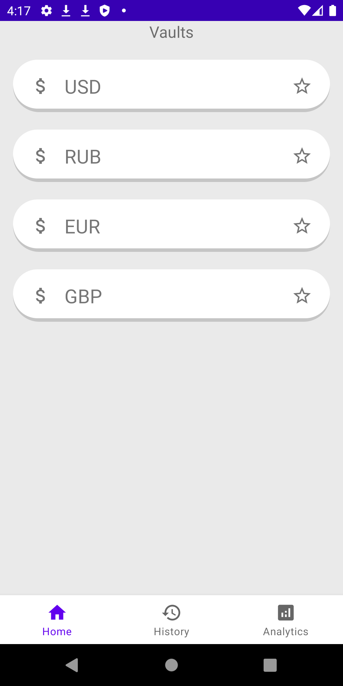
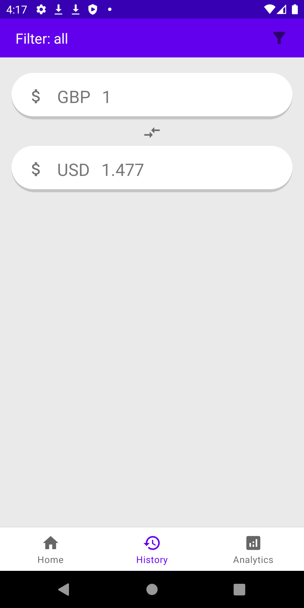
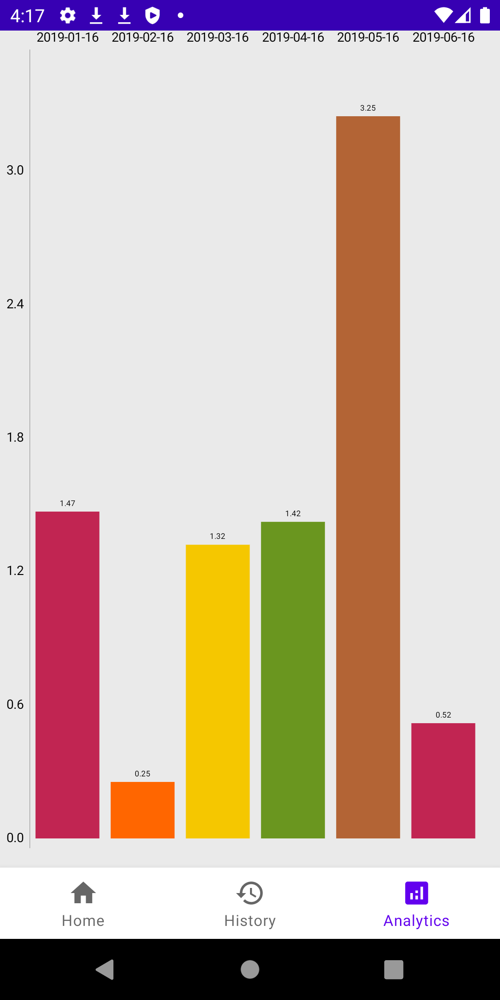
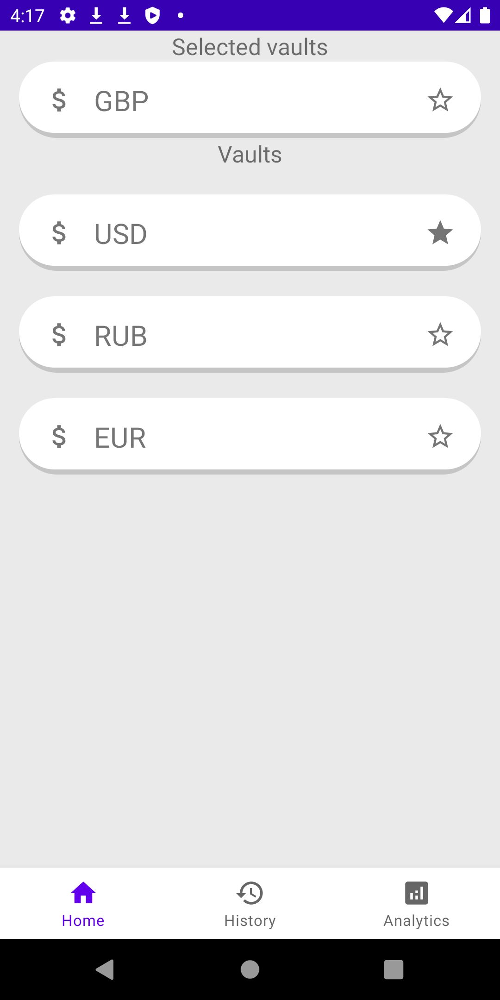
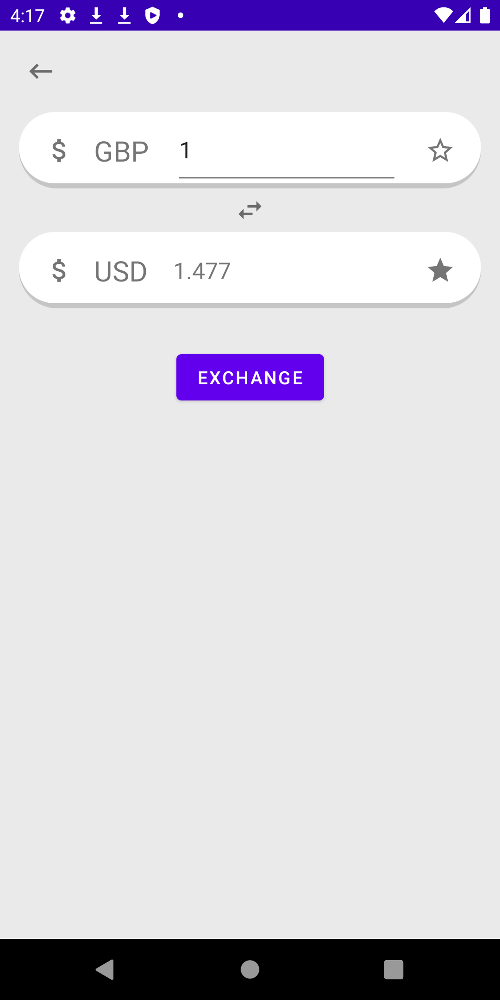
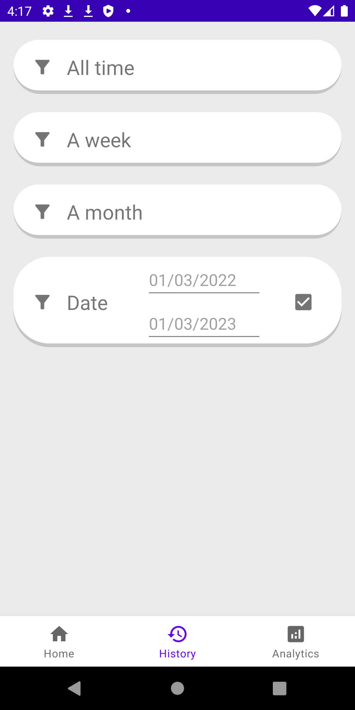

<h1 align="center">  Обменник валют</h1>

[](https://github.com/arkivanov/MVIKotlin/blob/master/LICENSE)

### О приложении

Данное приложение позволяет обменивать валюту по курсу [fixer.io](https://fixer.io), хранит в локальном хранилище данные
о совершенных операциях, предоставляет возможность просмотра роста и падения валютной пары за последнюю неделю.

***Основные экраны***

| Валюты  | История  | Статистика  |
|----------------------------------------------|------------------------------------------------|-----------------------------------------------------|

***Остальные экраны***

| Выбранная валюта  | Обмен  | Фильтрация  |
|----------------------------------------------------------|-----------------------------------------------|--------------------------------------------------|

### Технологии

* Язык: **Kotlin**
* Технологии: **Retrofit 2, Room, Glide, LiveData.**
* Паттерн: **MVVM**
* Дополнения для **[Coroutines](https://github.com/Kotlin/kotlinx.coroutines)**

## Установка

Рекомендованная версия **Gradle** - 5.3.

Напишите в терминале, после инициализируйте проект при помощи ***Android Studio***:

```git
git clone https://github.com/l1ve4code/vault-exchange.git
```

Модули в проекте:

- `retrofit2` - REST клиент для Java и Android.
- `retrofit2:converter-gson` - конвертер json формата для retrofit2.
- `room` - библиотека объектно-реляционного сопоставления (ORM).
- `kotlinx-coroutines` - механизм для выполнения асинхронных операций.
- `lifecycle-livedata-ktx` - инструмент для связывания состояния данных и объектов с жизненным циклом.
- `MPAndroidChart` - библиотека для создания графических представлений.

## Автор

* Telegram: **[@live4code](https://t.me/live4code)**
* Email: **steven.marelly@gmail.com**
